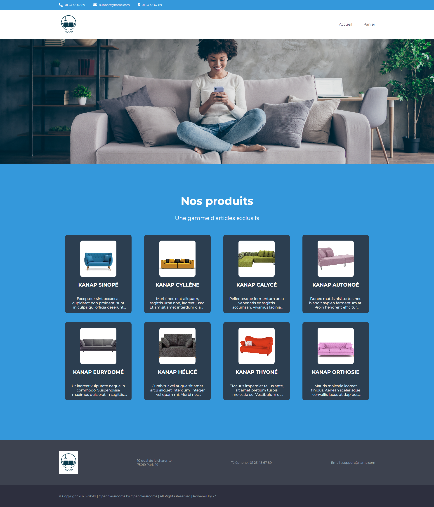

### Back end Prerequisites ###

You will need to have Node and `npm` installed locally on your machine.

### Back end Installation ###

Clone this repo. From the "back" folder of the project, run `npm install`. You 
can then run the server with `npm start`. 
The server should run on `localhost` with default port `3000`. If the
server runs on another port for any reason, this is printed to the
console when the server starts, e.g. `Listening on port 3001`.

Open [http://127.0.0.1:5502/front/html/index.html](http://127.0.0.1:5502/front/html/index.html) to view it in your browser (modify local url if necessary).

The page will reload when you make changes.

## Table of contents

-  [Overview](#overview)
   -  [Work done](#work-done)
   -  [Screenshot](#screenshot)
   -  [Links](#links)
-  [My process](#my-process)
   -  [Built with](#built-with)
   -  [Useful resources](#useful-resources)
-  [Author](#author)

## Overview

### Work done
All the backend and frontend was already provided.
The objective was to start all the JavaScript of the project from scratch, to allow the application to work :
- Display items on the main page
- Display the item informations on the product page
- Being able to chose a color and a quantity to add to the cart
- Display those items with the quantity/color chosen in the cart page
- Being able to modify the quantity and delete items from the cart
- Dynamically calculate the amount of items in the cart
- Dynamically calculate the total price of the cart
- Management of the form
- Validate the order with a command ID

### Screenshot

### Links

-  Live Site URL: use `npm start` and then open [http://127.0.0.1:5502/front/html/index.html](http://127.0.0.1:5502/front/html/index.html) to view it in your browser (modify local url if necessary)

## My process

### Built with

-  JavaScript

## Author

-  Linkedin - [Anthony Chanty](https://www.linkedin.com/in/anthony-c-a925a6172/)
-  Frontend Mentor - [@achanty](https://www.frontendmentor.io/profile/AChanty)
